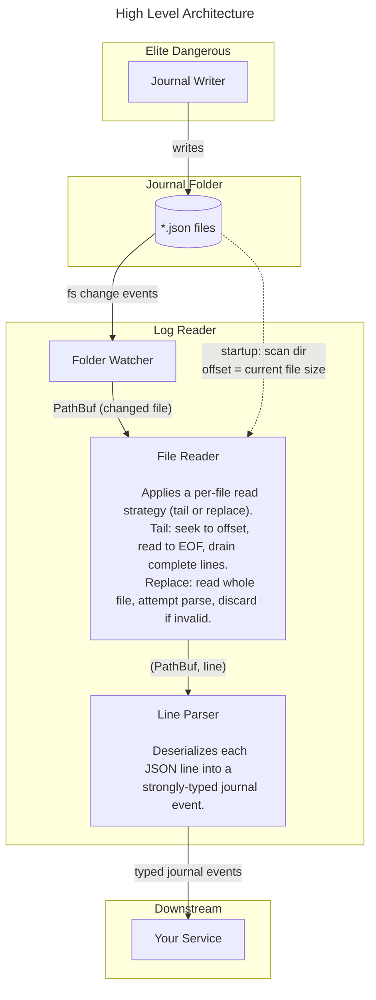

# Elite-Dangerous-Journal-Reader

On startup, the file reader scans the journal folder and records the current size of each file as
its initial read offset — this ensures only new content is processed, not data that already existed.

The folder watcher then monitors for filesystem changes. Each time a file is modified, it sends
that file's path to the file reader. The reader seeks to its stored offset for that file, reads to
EOF, and appends the new bytes to a per-file line buffer. When a complete line (terminated by `\n`)
is found, everything up to and including the newline is drained from the buffer and forwarded to the
line parser. The remaining bytes stay in the buffer until the next newline arrives. The offset is
updated to the new end of the file after each read.

Files that appear after startup are handled naturally — when the watcher fires for an unknown path,
the reader treats it as offset 0 and starts from the beginning.

The line parser deserializes each JSON line into a strongly-typed event and forwards it downstream
for processing.

## High Level Architecture

## TODO
- [ ] Implement `FileReader`: startup directory scan, per-file offset + buffer, line extraction
- [ ] Implement `LineParser`: serde_json deserialization into typed event enums
- [ ] Wire together in `lib.rs`: init reader → start watcher → spawn processing thread
