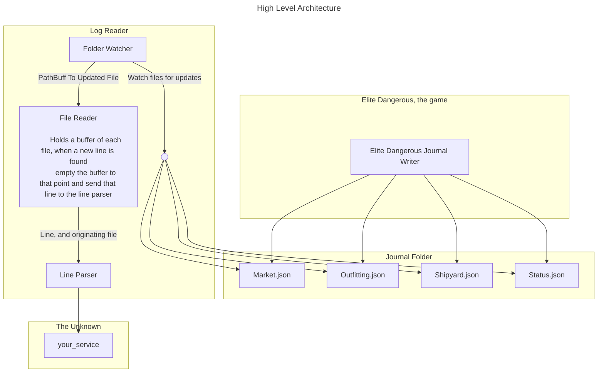

# Elite-Dangerous-Journal-Reader

The basic high level idea is to have a watcher keep an eye on journal files that the game writes to. Each time a file is
updated, we should send that file name to the reader. The reader will keep an index of the last byte read from each file,
as well as a buffer of text, when a file is updated the reader will read to the end of the file from the last byte read,
append that to the buffer, and if a new line is found, it will removed everything before that line and send it to the
line parser.

The line will then parse the json log into a a strongly typed object and will place it on a queue for processing.

## High Level Architecture

## TODO
Read up on Rust's mpsc